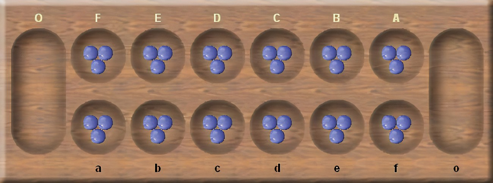

# Kalah Game Service

kalah-game-service


## Rules of the Game

* Players take turns to move stones from any of their small pits.
* In a move a player places the stones in every pit after the selected pit, anti-clockwise (towards right) round the
  board.
* In a move a player never places stones in their opponents big pit.
* If the move ends in the player's own big pit - they get another go.
* If the move ends in a player's own pit that was empty. They collect that last stone from that pit and all stones in
  the opponent's opposite pit.
* Play finishes when either player has no more moves to make (no more stones in any of small pits of either of the
  player).
* Winner of the game is the player who has the most stones in his big pit.

## Getting Started

These instructions will get you a copy of the project up and running on your local machine for development and testing
purposes. See deployment for notes on how to deploy the project on a system.

### Prerequisites

Things you need to get the project up and running on a local machine:

* Java 11
* Maven latest
* Docker Latest version

### Installing

Follow the below steps to build the application:

Step 1. Build the jar file using maven

  ```
    mvn clean install
  ```

Step 2. Build the docker image of the application by executing below command:

  ```
  docker build -f Dockerfile -t kalah .
  ```

### Running the application

* Running the jar from command line (if using maven to build the jar file)
  ```
  java -jar -Dspring.profiles.active=default target/kalah-0.0.1-SNAPSHOT.jar
  ```
  or
  ```
  mvn spring-boot:run
  ```
  or
  ```
  docker run -p 8080:8080 kalah
  ```

#### Swagger Endpoint

* Open 'http://localhost:8080/swagger-ui.html' in the web browser to open swagger to check REST apis.

#### REST services

* REST services can be accessed on: http://localhost:8080

#### Actuators

* Can be accessed on: http://localhost:8080/actuator

#### H2-Console

* Can be accessed on: http://localhost:8080/h2-console with below details:
  ```
  * JDBC URL:  jdbc:h2:mem:testdb
  * User Name: sa
  * Password: (no password required)
  ```

#### Postman Testing

* Sample package included for testing: KalahGameService.postman_collection

#### Newman Testing

* Newman is api testing tool.

* Prerequisite for Newman testing
    1. Install latest node.js
    2. Install npm package
    3. Install npm htmlextra package
* To test Kalah Game , sample test data is created under api-testing directory as TestData.csv
* PostmanCollection is also created under the same api-testing directory as KalahMoveCollection.postman_collection.json
* Run your application using the below command :

```
  mvn spring-boot:run
```

* Goto Postman and create a new Game

  * _Assumption : Game with id 1 is created or update the TestData with id=1 or other game created id._
* Goto the <your-home-directory>/kalah/api-test and run the newman run command as below:
```
  cd <your-home-directory>/<project-name>/api-test
  
  newman run "KalahMoveCollection.postman_collection.json" -r htmlextra -d TestData.csv
```
* On completion, generated test report can be found at <your-home-directory>/kalah/api-test as
  KalahMoveCollection-YYYY-MM-DD-HH-MM-SS-xxx-x.html (sample report included in the folder)
* Below are few screenshots of the report:
    1. 
    2. 
    3. 

